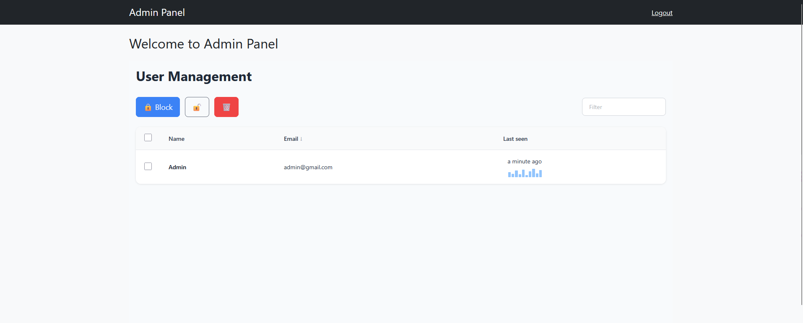

# MyWebApp

ASP.NET MVC application with support for:
- 🔐 User registration and authentication
- ⚙️ Administrative panel
- 🎨 Bootstrap and jQuery-based interface
- 🌐 Deployed on [yernar.runasp.net](https://yernar.runasp.net/)

## 🔧 Technologies Used

- ASP.NET MVC
- C#
- Dapper 
- Bootstrap 4/5
- jQuery
- MS SQL Server

## 🚀 Demo

The project is available at:  
👉 [https://yernar.runasp.net/](https://yernar.runasp.net/)

## 🖼 Preview

Here's how the application looks:

